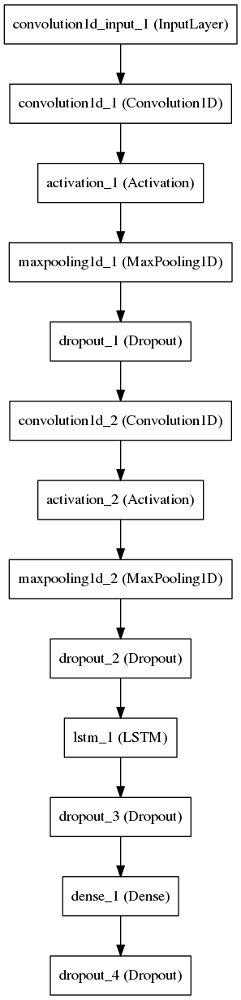
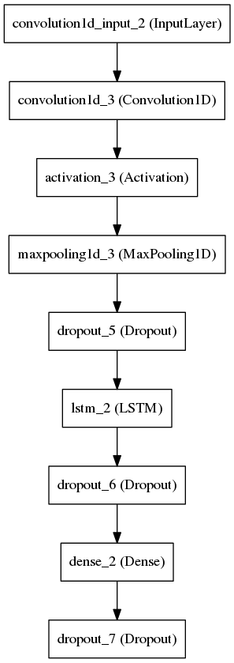
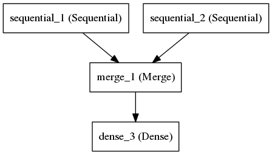

# Guide to Genre Recognition (From audio files to genres)

In this guide, I try to describe the steps needed to be taken to perform genre recognition.
Since this is a machine learning task, we shall follow the typical procedure of:

  * Preparing a dataset
  * Feature extraction
  * Training and testing model
  * Querying model

# Preliminaries

Firstly, I am not a super l33t 10x software engineer and I cobbled up most of this code in a day.
So, a lot of restructuring and refactoring should and could be done. This guide will show how to use the code as is. Clone the git repo, and switch the branch to working-model-0.1

    git clone https://github.com/amirothman/genre-erkennung-pipeline
    cd genre-erkennung-pipeline
    git checkout working-model-0.1

Now you should have all the code. But not all the data. But first, let's go through the requirement:

  * keras (deep learning framework)
  * sklearn (machine learning library)
  * matplotlib (plotting)
  * youtube-dl (to test data)

Outside of the python libraries we also require some command line tools:

  * ffmpeg (manipulating audio files)
  * sonic-annotator (Vamp feature extraction utility)

And we also need to install some Vamp plugins:

  * [QM-Vamp Plugins](https://code.soundsoftware.ac.uk/projects/qm-vamp-plugins/files)
  * [BBC Vamp Plugins](https://github.com/bbcrd/bbc-vamp-plugins/releases)

Refer to [here](http://mtg.upf.edu/technologies/melodia?p=Download%20and%20installation) for instructions to install vamp plugins on different platforms.

# Preparing a dataset

For legal reasons a dataset including music files can not be included. You have to use your own or a thid party one.

Most of the methods expect the folder "dataset" as the default directory path for the data. Create that folder inside the main project directory.
Inside this directory you can use different datasets.
Throughout the code base, we use the convention of _train_ set and _test_ set to separate our training data and testing data.
Now, you can put your data in the respective directories with each file in it's own genre folder. The code uses the name of the directory as the genre. Here is an example of how a dataset directory should look like:

```
└── my_data_set
    ├── test
    │   ├── genre1
    │   │   ├── 010._Ольга_Василюк_-_Нет_Тебя.mp3
    │   │   ├── 017._Eros_Ramazzotti_-_Perfetto.mp3
    │   │   └── 018._T.I._Feat._Pharrell_-_Oh_Yeah.mp3
    │   └── genre2
    │       ├── 011._Maan_-_Perfect_World__Prod._by_Hardwell_.mp3
    │       ├── 015._Глюкоза_-_Согрей.mp3
    │       └── 016._Вика_Воронина_Feat._Storm_Djs_-_Угги.mp3
    └── train
        ├── genre1
        │   ├── 004._Prides_-_Out_Of_The_Blue.mp3
        │   ├── 008._Марина_Алиева_-_Подари_Любовь.mp3
        │   └── 009._Чи-Ли_-_Ангел_На_Моём_Плече.mp3
        └── genre2
            ├── 001._Paul_Van_Dyk_-_Lights.mp3
            ├── 002._Zedd,_Bahari_-_Addicted_To_A_Memory.mp3
            └── 003._MOYYO_-_Имя_Moyyo.mp3

```

I've written a bash script `sample_song.sh` to automaticcaly split a dataset into test set and training set. If you are a shell ninja, you can edit the script to split the dataset.

You can have as many genres as you want. Just make sure:

  * Both training and testing sets include the same genres
  * The split between test set and training set is sensible

The format of the audio can be any audio format that is supported by sonic-annotator and ffmpeg.
One preprocessing step before we continue to feature extraction:

  * is splitting the audio files into 30 second chunks - to make it more manageable

To do this, we can use the ``split_30_seconds_mono.py`` script. The method used here is ``batch_thirty_seconds(folder_path,file_format)``. In our case, `folder_path` would be ``my_data_set`` and `file_format` would be ``mp3``. You should edit this in the main part of the code.

    batch_thirty_seconds(folder_path,file_format)
      folder_path: string of directory path (where the folder train and test is)
      file_format: string of audio format (e.g. 'mp3', 'au', etc.)

Run `split_30_seconds.py` with:

    python split_30_seconds_mono.py <path to dataset> <file fomat>

If your audio files contain spaces or some other weird characters, this script will throw an error. You can use the script space_to_underscore.sh to rename them.

# Feature Extraction

Congratulations that you got this far. Now we will do feature extraction with `sonic-annotator`. What we will do is to first convert the audio files into CSV files with features, then convert the CSV files into Numpy arrays and serialize them with pickle. We can actually create the numpy arrays directly, skipping the csv files but:

  * I was not aware of it during that time (Haha)
  * It's actually much slower. Probably because the vamp host is a python implementation.
audio file > csv > numpy > pickle

The python script ``extract_features.py`` will be used here. The method is extract_features;

  extract_features(path)
    path: string of data path to do feature extraction

You should edit this in the main part of the code and run the script.

    python extract_features.py

After running that script, you will realize a bunch of csv files in your dataset. It may take a while for this process to finish. Have a cup of coffee or a line of cocaine. Depends on which level of rockstar you are.


After that step you would have a bunch of csv files. Now to convert them into numpy arrays and pickle them, so you can reuse and abuse them. For this we will turn to ``parse_songs.py``. The method which we will utilize is ``build_vectors``

    build_vectors(folder_path,keyword,lower_limit)
      folder_path: string for path of dataset
      keyword: string for keyword of feature e.g. "spectral-contrast_peaks". This will be used to match the csv file output by sonic-annotator
      lower_limit: integer for the index of column of the csv file to use. The first column is a timestamp. Sometimes, we do not want this in our array.

For our example:

    build_vectors(folder_path="dataset/my_data_set",keyword="spectral-contrast_peaks",lower_limit=1)
    build_vectors(folder_path="dataset/my_data_set",keyword="mfcc_coefficients",lower_limit=1)

As before pass the path to the dataset.

    python parse_songs.py <path to dataset>

If you check the folder pickled_vectors you should have your pickled vectors saved there.

    ls pickled_vectors

If it is empty, you probably messed up something. Call the ambulance.

# Training Model

Awesome. You've reached here. This is the machine learning step. The most interesting step. There are two separate models for the two different features. The models are in two different scripts, mfcc_model.py and spectral-contrast_peaks_model.py. The merged model is in the script prototype_merged.py. You can train each model separately or combining them. Let's try just one model first, then the other one then the merged one.

## MFCC Model



Change the X, y, X_test, and y_test variable to load the pickled vectors of your desire. If you are following this tutorial, it would be:

    X = pickle.load(open("pickled_vectors/mfcc_coefficients_training_vector.pickle","rb"))
    y = pickle.load(open("pickled_vectors/mfcc_coefficients_label.pickle","rb"))

    X_test = pickle.load(open("pickled_vectors/mfcc_coefficients_evaluation_training_vector.pickle","rb"))
    y_test = pickle.load(open("pickled_vectors/mfcc_coefficients_evaluation_label.pickle","rb"))

Now you can run this model with:

    python mfcc_model.py

Or if you have configured CUDA on your machine, you can also use keras_gpu.sh. This is probably the wrongest hackiest way to run Theano code with Cuda but, it works for now.

    sh keras_gpu.sh mfcc_model.py

One thing that you may have to further edit is the number of outputs of your neural network. On this line:

    model.add(Dense(2))

2 refers to 2 genres. If your dataset have 10 genres, change it 10.

## Spectral Contrast Model



As before, change the X, y, X_test, and y_test variable to load the pickled vectors of your desire. For our example:

    X = pickle.load(open("pickled_vectors/spectral-contrast_peaks_training_vector.pickle","rb"))
    y = pickle.load(open("pickled_vectors/spectral-contrast_peaks_label.pickle","rb"))

    X_test = pickle.load(open("pickled_vectors/spectral-contrast_peaks_evaluation_training_vector.pickle","rb"))
    y_test = pickle.load(open("pickled_vectors/spectral-contrast_peaks_evaluation_label.pickle","rb"))

Now you can run this model with:

    python spectral_contrast_peaks_model.py

Or if you have configured CUDA on your machine, you can also use keras_gpu.sh. This is probably the wrongest hackiest way to run Theano code with Cuda but, it works for now.

    sh keras_gpu.sh spectral_contrast_peaks_model.py

One thing that you may have to further edit is the number of outputs of your neural network. On this line:

    model.add(Dense(2))

2 refers to 2 genres. If your dataset have 10 genres, change it 10.

## Merged Model



Here, we have merged model. It combining the two previous model and concatenate them into one model. We have two different example (X vectors), so a bit different than before, we will have to change X_1, X_2, X_test_1, X_test_2, y and y_test. For our example:

    y = pickle.load(open("pickled_vectors/mfcc_coefficients_label.pickle","rb"))
    y_test = pickle.load(open("pickled_vectors/mfcc_coefficients_evaluation_label.pickle","rb"))

    X_1 = pickle.load(open("pickled_vectors/mfcc_coefficients_training_vector.pickle","rb"))
    X_test_1 = pickle.load(open("pickled_vectors/mfcc_coefficients_evaluation_training_vector.pickle","rb"))

    X_2 = pickle.load(open("pickled_vectors/spectral-contrast_peaks_training_vector.pickle","rb"))
    X_test_2 = pickle.load(open("pickled_vectors/spectral-contrast_peaks_evaluation_training_vector.pickle","rb"))

One thing that you may have to further edit is the number of outputs of your neural network. On this line:

    model.add(Dense(2))

2 refers to 2 genres. If your dataset have 10 genres, change it 10.

Before running this model, you may want to save the weights some where. Let's create that directory.

    mkdir model_weights

Uncomment the following line:

    final_model.save_weights("model_weights/merged_model_weights.hdf5",overwrite=True)

Now you can run this model with:

    python prototype_merged.py

Or if you have configured CUDA on your machine, you can also use keras_gpu.sh. This is probably the wrongest hackiest way to run Theano code with Cuda but, it works for now.

    sh keras_gpu.sh prototype_merged.py

If everything goes well, I would like to congratulate you again. You have successfully trained a deep learning model. It's an ok-ish model, but at this point you can already use fancy buzz words like deep learning, artificial intelligence or the same technology behind google's deepmind.

Awesome.

# Querying The Model

Now you would like to ask the model. By giving it a song, what would the model predict? Firstly, the song which the model would need to predict, would have to go through the whole pipeline.

The merge model, saved it's architecture into a json file. This happened in the following part of the prototype_merged.py

```
  json_string = final_model.to_json()
  with open("model_architecture/merged_model_architecture.json","w") as f:
      f.write(json.dumps(json_string, sort_keys=True,indent=4, separators=(',', ': ')))
```

The trained weights should be saved in the following hdf5 file:

    model_weights/merged_model_weights.hdf5

So what we have to do to query the model are:
  * extract the features from the song
  * load the model architecture
  * load the model weights
  * get some prediction


For this purpose, the script querying_genre.py is made. Make sure the right architecture is loaded:

    json_string = json.load(open("model_architecture/merged_model_architecture.json","r"))

And also the right weights:

    model.load_weights("model_weights/merged_model_weights.hdf5")

Now for the song in question. Let's put that song inside dataset in the folder query

    cd dataset
    mkdir query

We shall create another folder for this one particular query.

    cd query
    mkdir song_1

Let's grab a song on Youtube with youtube-dl.

    youtube-dl -x https://www.youtube.com/watch?v=VDvr08sCPOc

For hacky reasons, the filename of the song needs to correspond to the name of the folder.

    mv Remember\ The\ Name\ \(Official\ Video\)\ -\ Fort\ Minor-VDvr08sCPOc.opus song_1.opus

sonic-annotator does not support the opus file format. We are going to need to convert it to mp3 , or what ever format that you like as long as sonic-annotator supports it.

    ffmpeg -i song_1.opus song_1.mp3

We are going to have delete the dot opus file. Again, for hacky my-code-kinda-sucks reasons.

    rm song_1.opus

Now let's edit querying_genre.py so that it corresponds to our song query.

```
song_name_without_ending = "dataset/query/song_1/song_1"
file_format = "mp3"
song_folder = "dataset/query/song_1"

```

Let's run this script.

    python querying_genre.py

An example of the output would be something like:

    [1 1 0 0 1 0 0 1]

What does this mean? The song is split into 30 seconds chunks. The model predicts genre_1 for the first two 30 second chunks and genre_2 for the following. Of course we can do a lot more cleverer and more sophisticated ways to determine what the model determine. But if we take the mode of the output as the model's decision, we can say that the song that we had, was of genre_2.

Hope you had fun following this tutorial. It is useful to read the documentation of Keras if you want tweak the model.
